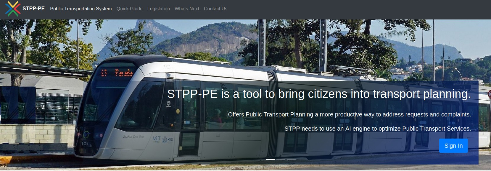

# STPP-Public-Transportation-Planning-tool

 STPP is an Online Program designed to meet a specific need to respond to requests and complaints from citizens/communities about public transport planning in Recife, Brazil.
 

Browse through the homepage, register, log in and begin propose solutions. Click on the **Quick Guide** link at the top left of the screen and view the steps to complete an action request submitted by a public transport user.

## Inside User Interface Area - Logged In

    

1 - Receive the request by email from an ombudsman center in your inbox,
    Receba na caixa de entrada a solicitação por email de uma central de ouvidoria,

2 - Find out if requests about bus lines, metro or about the integration between the two modes are valid. Use maps, database search and legislation consultation to understand the requirement and conditions in the operation of the line in question.

    Investigue se as solicitações sobre linhas de onibus, metro ou sobre a integração entre os dois modais são válidas. Use mapas, busca em banco de dados e consulta de legislação para entender a solicitação e as condições na operaçao da linha em questão.

3 - If the case calls for a faster and more economical way of getting around, look for the best route within the bus/metro integration system and send the proposal. If necessary, discuss the situation with the planning team, find representatives of the bus operators, develop a solution and respond to the request.

    Se o caso solicita uma maneira mais rápida e economica de deslocamento, procure a melhor rota dentro do sistema de integração ônibus/metrô e envie a proposta. Discuta a situação com a equipe de planejamento, procure representantes das operadoras de onibus, desenvolva um solução e responda a solicitação.

### Sending a Complaint or request

    The beta version has some examples of requesting public transport arrangements. For this trial version it will be possible to send complaints and requests to your inbox. Generally, the ombudsman sends the requests. In this test version, the center will not send emails, as this feature is only available in the official version for public analysts in the transport sector in the city of Recife.

    From the side menu, press SEND COMPLAINT to open the request/complaint form. The registered request will go to your inbox.

    A versão beta traz alguns exemplos de solicitação de providências no transporte público. Para esta versão teste será possível enviar reclamações e solicitações para sua caixa de entrada. Geralmente, a central de ouvidoria envia as solicitações. Nesta versão teste a central não enviará emails, visto que este recurso está disponível apenas na versão oficial para analistas públicos do setor de transporte na cidade do Recife.

    No menu lateral, pressione SEND COMPLAINT para abrir o formulário de solicitação/reclamação. A solicitação registrada vai seguir para a sua caixa de entrada. 

    

### Openning a Complaint or request

Select INBOX on the side menu and access requests and complaints

Selecione INBOX no menu lateral e acesse as solicitações e reclamações

    

Choose an action request by pressing the REPLY button. Please read the request carefully.

Escolha uma solicitação de providências pressionando o botão REPLY. Leia a solicitação com atenção.

    

### Investigating Complaints and requests

    From the side menu, press the Search Database link to search for similar requests. Search by keyword, bus line code or nomenclature, subway station name or any other keyword that finds a similar situation.

    No menu lateral, pressione o link Search Database para fazer uma busca por solicitações similares. Faça busca por keyword, código ou nomenclatura da linha, nome da estação do metrô ou qualquer outra palavra-chave que encontre uma situação parecida.

    

    Choose Maps and Directions from the side menu and search for bus itineraries on google maps, specifying origin and destination, search for addresses, neighborhoods, bus terminals or subway stations to understand the operation of the line reported in the claim.

    Escolha Maps and Directions no menu lateral e faça buscas por itinerários de ônibus no google maps, especificando origem e destino, procure por endereços, bairros, terminais de ônibus ou estações do metrô para entender a operação da linha relatada na reclamação. 

    

    On the side menu, press Legislation to open files in pdf format with the current laws that govern the public transport system in the metropolitan region of Recife. You will find the operation manual of the bus lines, the regulation of the integration system and the municipal laws of the cities that are part of the Metropolitan Transport Consortium.

    Other options such as Discussion Forums and Chatroom with analysts, bus companies and the general population are needed to reach agreement on changes to the transport system more quickly.

    No menu lateral pressione Legislation para abrir arquivos no formato pdf com as leis atuais que regem o sistema de transporte público na região metropolitana do Recife. Você vai encontrar o manual de operação das linhas de ônibus, o regulamento do sistema de integração e as leis municipais das cidades que fazem parte do Consórcio de Transporte Metropolitano.

    Outras opções como Foruns de Discussões e Chatroom com analistas, empresas de ônibus e a população em geral são necessárias para chegar a um acordo sobre mudanças no sistema de transporte com mais rapidez.

### Finishing a Request/Complaint 

    After investigating the facts and reaching a conclusion, click on the inbox link in the side menu and select the complaint by pressing the reply button. In future versions, the analyst will be able to dictate a response using a speech to text speech recognition tool.

    Após investigar os fatos e chegar a uma conclusão, click no link inbox no menu lateral e selecione a reclamação pressionando o botão reply. Nas próximas versões o analista poderá ditar uma resposta usando uma ferramenta de reconhecimento de voz speech to text.

    A confirmation will be requested, giving the analyst the opportunity to review the question and confirm the sending of the answer with the solution found, or directing the citizen to make further referrals to the request.

    Será solicitada uma confirmação, dando a oportunidade para o analista rever a questão e confirmar o envio da resposta com a solução encontrada, ou orientando o cidadão a dar outros encaminhamentos à solicitação.

     ## Settings

    The beta version only allows the user to change their own password. Other options such as telephone number, email and additional information about the position and institution linked to public transport are restricted to public officials in the transport sector in the region. Map and database option settings will be implemented in future releases.

    A vesão beta permite apenas ao usuário trocar sua própria senha. Outras opções como número de telefone, email e informações adicionais do cargo e instituição ligada ao transporte público ficam restrita aos funcionários públicos do setor de transporte na região. As configurações de opções de mapas e base de dados serão implementadas nas próximas versões.

### Changing Password

    The only requirement is that the password be exactly 6 digits long and the username be at least 6 digits long.
    The logged in user can change their password by confirming the username and entering a new six-digit password. The system confirms that the user is logged in and changes the password without the need to confirm email. In the official version, the government employee will enter the email and personal data registered at the time of hiring.

    A única exigência é que a senha tenha exatamente 6 digitos e o nome do usuário tenham 6 digitos no mínimo.
    O usuário logado poderá trocar sua password confirmando o username e inserindo uma nova password de seis dígitos. O sistema confirma que o usuário está logado e troca a password sem necessidade de confirmar email. Na versão oficial, o funcionário público irá inserir o email e dados pessoais registrados no ato da sua contratação.

### Contact and Reporting a Bug

    We need to evaluate the application performance. Feel free to submit a bug. We appreciate the effort.

    The contact form uses gmail to send messages to the program developer. No name or email required to get in touch. Just send the subject and message.

    A equipe de desenvolvimento precisa avaliar o desempenho do aplicativo. Sinta-se à vontade para enviar um bug. Agradecemos o esforço.

    O formulário de contato usa o gmail para enviar mensagens para o desenvolvedor do programa. Não é necessário nome ou email para entrar em contato. Apenas especifique o assunto e escreva a mensagem

## Limitations

Na pesquisa por mapas a API do Google Maps precisa ser implementada para aumentar as opções de busca.

O Google Maps não inclui nos resultados a integração ônibus e metrô na região. Apenas mostra as opções de linhas de ônibus.

A busca no banco de dados precisa incluir os itinerários de todas as linhas disponívies no sistema. Para isso, é preciso integrar o STPP aos servidores da núvem do Governo do Estado de Pernmabuco ou solicitar às empresas operadoras de ônibus da região.

O aplicativo trabalha com dados sigilosos enviados para os servidores da central de ouvidoria. Por este motivo esses dados não estarão disponíveis para a investigação. Por outro lado, toda a legislação pode ser consultada na versão beta.

A caixa de entrada dos usuários terá alguns exemplos de solicitações para serem concluídas. O analista poderá enviar novas solicitações para a caixa de entrada selecionando Send Complaint/Request no menu lateral. Na próxima versão o analista receberá as novas mensagens através do API do Gmail.

