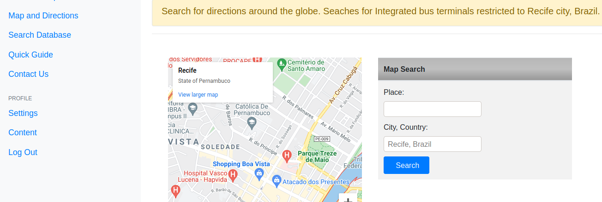

# STPP Public Transportation Planning tool
#### Video Demo:  <URL HERE>

STPP is a Web-based Application designed to respond to requests and complaints from citizens/communities about public transport planning in Recife, Brazil.

Browse through the website, register, log in and start proposing solutions.
<!---->

Click **Quick Guide** link at the top left of the screen and view the steps to solve a request submitted by a transport user.  
&nbsp;  

&nbsp;  
## Design Choices
  
  ***Artificial Inteligence***

The application must receive emails, access all sorts of maps and data, negociate solutions with the plannnig team and reply to citizen, using only one platform. 

  I decided to create an response platform with Google Maps API, database searches, current laws consultation and discussion forum to help with the outcome. The system must be integrated with the public transport cloud monitoring system and Ombudsman Central database.
  
  It became clear that complaints and requests could feed an artificial intelligence capable of predicting routes and connections faster and more efficiently. So, an intelligence that could navigate through transport regulation,  Google maps API and  ombudsman's database to create solutions will be implemented in future versions.

  Should I create a star page explaining the system proposal?
I decided to make a more elaborate presentation page with a bootstrap template.

Speech-to-text voice recognition tool. Python libraries was too slow. Paid options is not possible at the moment.
  
&nbsp;  

&nbsp;  
## Inside User Interface Area - Logged In

  
Explore the options:

**Inbox** - List of requests complaints and messages sent from a Ombudsman Central.

**Send Complaint** - This version allows you to send your own complaint or request about public transportation in your city.
  
**Maps and Direction** - Search for bus routes and places aroud the world, and bus terminals in Recife.
  
**Search Database** - In future versions, it will be integrated to the State Government Cloud System and GPS Fleet Monitoring.

**Legislation** - Consult Recife Metropolitan Region Transportation System's current laws.
  
**Quick Guide** - Learn more about the process of creating solutions to people's requests.
  
**Contact Us** - Send a message to the development team.

**Settings** - You can change your password and check other settings options.
  
**Content** - You can change user main page content.
  
**Logou** - Leave user area

&nbsp;  

&nbsp;  

---
#### Send Complaints and Requests
---

  
From the side menu, press Send Complaint link to open request/complaint form.

For this trial version, it will be possible to send complaints and requests to your own inbox. 

Ombudsman Central messages are available only for transport sector analysts. 
&nbsp;  

&nbsp;  

----
#### Openning a Complaint or Request
---

Select a request from your inbox
 
Choose a request by pressing REPLY button.

**Read the request carefully.**
&nbsp;  

&nbsp;  

---
#### Investigate Complaints and requests
---

#### Database Search

  From the side menu, press the Search Database link to search for previous cases and solutions.

  Search by keyword, bus line code or name, subway station name or any other keyword.
  
  Soon, it will be integrated to the State Government Cloud System and GPS Fleet Monitoring. The system will have access to real time fleet monitoring and Cloud database.
&nbsp;  

&nbsp;  

#### Map Search

Choose Maps and Directions from the side menu

Search google maps for bus itineraries, directions, search for addresses, neighborhoods, bus terminals or subway stations to find a solution to the problem.
&nbsp;  

&nbsp;  

#### Legislation 
  
Click Legislation link to open pdf files and find the current laws that rule the public transport system.
  
You will find operation manual, integration system regulation and Transport Consortium member cities municipality regulation.
&nbsp;  

&nbsp;  

#### Discussion Forum and Chatroom
Other options such as Discussion Forums and Chatroom are important tools to investigate and negociate solutions.
&nbsp;  

&nbsp;  

---
### Reply to Requests/Complaints
---

Once you've established the facts and come to a conclusion, go to your inbox  and select the complaint by clicking the reply button. In future versions, analysts will use a speech recognition tool to create reply messages.

Use a confirmation screen to review the request and solution or instruct the citizen on how to achieve the objective&nbsp;  

&nbsp;  

---
### Settings
---

#### Change Password

The only requirement is that the password and username are at least 6 digits long. No email is required in this trial version. Usually,  public officials provide personal information at the time of hiring. 
  
Beta version only allows password change. Other options such as telephone, email and additional information about the body linked to public transport are restricted to public officials. More map and database search options will be implemented in future releases.
&nbsp;  

&nbsp;  

&nbsp;  

&nbsp;  

---
### Contact and Report a Bug
---

We need to evaluate the application performance. Feel free to submit a bug. We appreciate the effort.
The contact form uses gmail to send messages. No name or email is required to get in touch. Just send subject and message.

&nbsp;  

&nbsp;  

---
### Limitations
---
The Google Maps API needs to be implemented to provide more search options.

Google Maps does not include bus/subway integration results.
  

In future versions database search must include all line routes available in the system. We need to integrate the STPP application with the State of Pernmabuco's cloud system. 

The application works with sensitive data sent by the ombudsman's servers. These data are not available for investigation. On the other hand, all legislation can be consulted during beta tests.
  
Content Management is avalilabe for changing texts in your user main main page only. In future versions, a complete content management will be implemented as well as a news feed.

