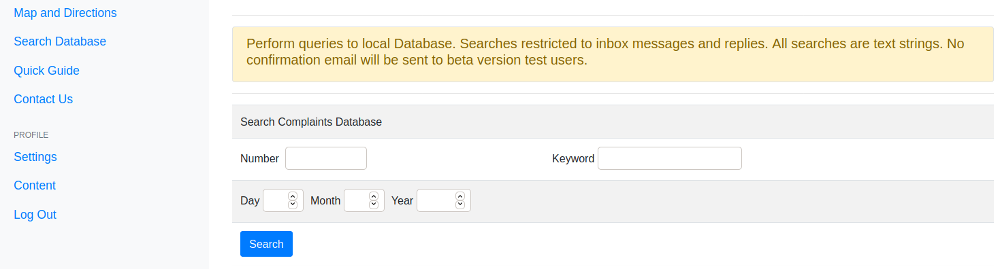

# STPP-Public-Transportation-Planning-tool

STPP is an Online Program designed to meet a specific need to respond to requests and complaints from citizens/communities about public transport planning in Recife, Brazil.

Browse through the homepage, register, log in and begin proposing solutions. 

Click on the **Quick Guide** link at the top left of the screen and view the steps to solve a request submitted by a transport user.

## Inside User Interface Area - Logged In

1 - Receive the request by email from an ombudsman center in your inbox,

2 - Find out if requests or complaints are valid. Use maps, database search and legal consultation to explain the operation of the line mentioned in the request.

3 - if the requested itinerary does not exist, explain the reasons or propose a solution.

4 -  If necessary, discuss the situation with the planning team, find representatives of the bus operators, develop a solution and respond to the request.

---
#### Sending a Complaint or request
---

From the side menu, press **Send Complaint** to open request/complaint form.

Some sample complaints and requests are available for testing.

For this trial version it will be possible to send complaints and requests to your own inbox. 

Ombudsman messages are available in official version for transport sector analysts.  
&nbsp     

----
#### Openning a Complaint or request
---

Select INBOX on the side menu and access requests and complaints
Choose a request by pressing the REPLY button.

**Read the request carefully.**

---
### Investigating Complaints and requests
---

#### Database Search
From the side menu, press the **Search Database** link to search for previous cases and solutions.

Search by keyword, bus line code or name, subway station name or any other keyword.

#### Map Search
Choose **Maps and Directions** from the side menu

Search for bus itineraries on google maps, origin and destination directions, search for addresses, neighborhoods, bus terminals or subway stations to find a solution to the problem.

#### Legislation 
On the side menu, press Legislation to open files in pdf format with the current laws that rule the public transport system.
You will find the operation manual, the regulation of the integration system and the cities that are part of the Transport Consortium.

#### Discussion Forum and Chatroom
Other options such as Discussion Forums and Chatroom with analysts, bus companies and the general population are needed to reach an agreement on changes to the transport system more quickly.

---
### Reply to Request/Complaint 
---

After investigating the facts and reaching a conclusion, click on the **inbox** link in the side menu and select the complaint by pressing the **reply button**. In future versions, the analyst will be able to use a speech recognition tool.

A confirmation will be requested, giving the analyst the opportunity to review the question and confirm the solution found, or directing the citizen to make further referrals to the request.

---
### Settings
---

The beta version only allows users to change password. Other options such as telephone number, email and additional information about the agency linked to public transport are restricted to public officials. Map and database option settings will be implemented in future releases.

#### Changing Password

The only requirement is that the password be exactly 6 digits long and the username be at least 6 digits long.
The logged in user can change password by confirming the username and entering a new six-digit password. The system confirms that the user is logged in and changes the password. No email is required in this test version. Usually, the government employee will enter email and personal data registered at the time of hiring.

## Contact and Reporting a Bug

We need to evaluate the application performance. Feel free to submit a bug. We appreciate the effort.
The contact form uses gmail to send messages. No name or email required to get in touch. Just send subject and message.

## Limitations

When searching for maps, Google Maps API needs to be implemented to offer more search options.

Google Maps does not include bus/subway integration results. It only shows the options for bus lines.

The database search needs to include the itineraries of all lines available in the system. We need to integrate the STPP application with the State of Pernmabuco's cloud system.

The application works with sensitive data sent by the ombudsman's servers. For this reason, these data will not be available for investigation. On the other hand, all legislation can be consulted during beta tests.

